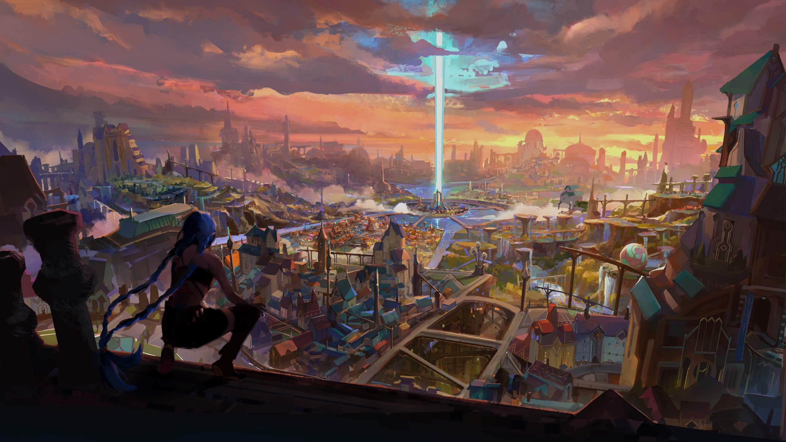

  
  &#8287;&#8287;&#8287;&#8287;&#8287;
  
  &#8287;&#8287;&#8287;&#8287;&#8287;
  
  &#8287;&#8287;&#8287;&#8287;&#8287;
  
  &#8287;&#8287;&#8287;&#8287;&#8287;
  
  <!-- &#8287;&#8287;&#8287;&#8287;&#8287; -->
  <!--  -->

 

  
Hi 👋, I am **Suryansh** an enthusiastic and ambitious full stack developer. I specialize in Python, Web Development, Javascript, Go Lang, Desktop App Development, Cryptography, Mobile App Development. I love the idea of Open Source and Community and always try to enrich my work with breathtaking visual elements and add a spark of mischief. ✨

  
🧑 More about me

-   🔭 I’m currently on a path to contribute to the world with my **Ideas**

-   🌱 I’m currently learning **AI/ML with a touch of Cloud** 🤓

-   🤝 I’m looking for **People who have the same passion for Open Source and Projects to contribute to**

-   👨‍💻 All of my projects are available at [Suryansh-23](https://github.com/Suryansh-23)

-   💬 Ask me about **Open Source, Web Development, Python, Cryptography, AI & ML,Recreational Maths**

-   📫 Reach me out at **darthvader4u@duck.com**

-   💖 And, Yes I loved **Arcane**

  

  
---
## 🔥 Github Stats

</a>

---

## ✨ Some Amazing Open Source Projects

  
 
  
  
  

  
  
  
    
<!--    -->

---

## 🎮 Try pressing the buttons and come back down

 
  
 
  

  

---

